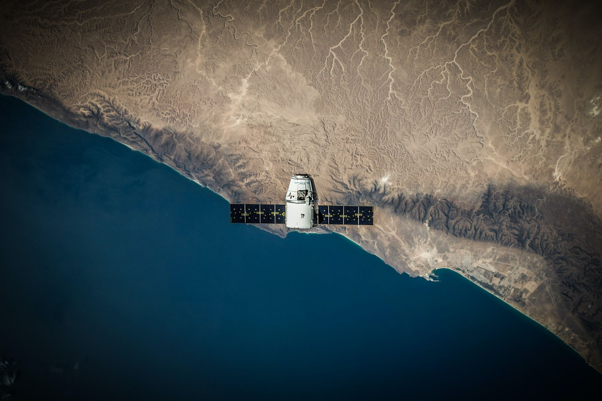
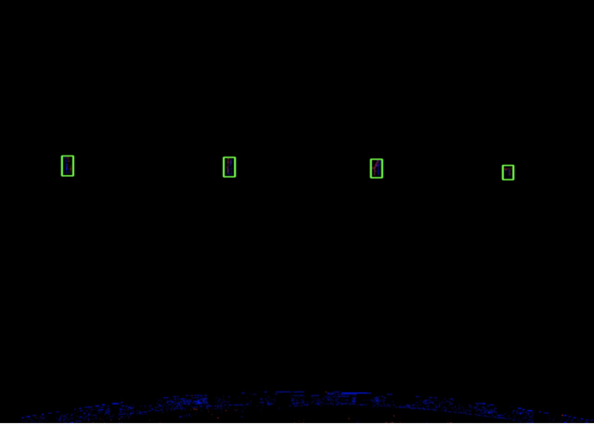

# EventCamera Spacecraft Detection
- Bonus project for Space Mission Design WS 2023 at TUM
- Goal: Using ML techniques, use image processing for automatic identification of satellites given video of spacecrafts in orbit

  
   

(Image Source: Valispace)

_________
# How to run locally
- Simply install all Python dependencies, specified in requirements.txt.
   `pip install -r requirements.txt`
